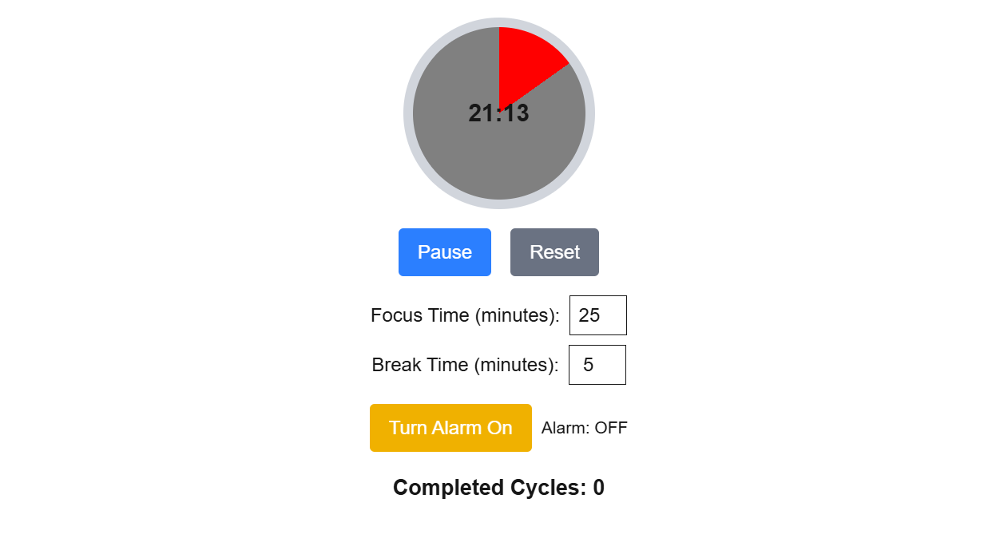

<h1>⏳ Pomodoro Timer</h1>

A simple Pomodoro timer built with <strong>Next.js</strong>, <strong>React</strong>, <strong>Framer Motion</strong>, and <strong>Tailwind CSS</strong>. 
It helps you stay focused by alternating between focus and break sessions.

<h2>📝 Project Overview</h2>

This timer follows the Pomodoro Technique — work in short bursts with regular breaks to boost productivity. 
You can customize session durations, switch modes, and track how many focus sessions you've completed.

<h2>🚀 Features</h2>
<ul>
  <li>✅ Focus &amp; Break mode with auto-switch</li>
  <li>⏸️ Start / Pause / Reset control</li>
  <li>🔁 Session cycle counter</li>
  <li>⏱️ Customizable focus and break durations</li>
  <li>🌀 Animated timer ring using Framer Motion</li>
  <li>🎨 Minimal UI with Tailwind CSS</li>
</ul>

<h2>💻 How to Run</h2>
<ol>
  <li><strong>Clone the project:</strong> 
    <code>git clone https://github.com/SYW77/PomodoroTimer.git 
    cd PomodoroTimer</code>
  </li>
  <li><strong>Install dependencies:</strong> 
    <code>npm install</code>
  </li>
  <li><strong>Run the development server:</strong> 
    <code>npm run dev</code>
  </li>
</ol>

Then visit: <a href="http://localhost:3000/pomodoro">http://localhost:3000/pomodoro</a>

<h2>🛠️ Tech Stack</h2>
<ul>
  <li>Next.js 13+ (App Router)</li>
  <li>React Hooks</li>
  <li>Framer Motion</li>
  <li>Tailwind CSS</li>
</ul>

<h2>📸 Screenshot</h2>

<h2>📄 License</h2>

This project is licensed under the CC BY-NC 4.0 License.   
See the [LICENSE](./LICENSE) file for details.

<h2>👤 Author</h2>

Made by <strong>SYW77</strong> 
Feel free to fork, contribute, or suggest improvements.

<h2>📌 Upcoming Update</h2>
<ul>
  <li>🔔 Add optional alarm sound when the timer ends</li>
</ul>
